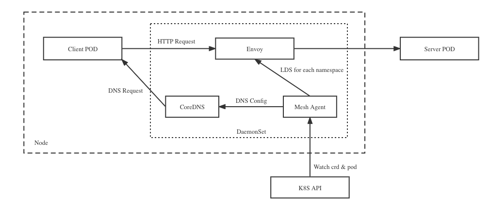

# KindMesh

简单易用的七层网络服务网格方案。


# Motivation

- 相比于中心化网关或SDK实现网络通信方案，KindMesh在最小化网络延时的同时，将网络通信、服务治理能力下沉到网格网关中，降低业务程序与基础平台的偶合以及多语言SDK开发成本。
- 当前Kubernetes中网络通信是Service为基础的，缺少流量治理能力，Service数量多时因为当前技术原因存在性能问题。KindMesh对用户屏蔽了四层网络的配置，当然这也要求用户只能用于七层网络的通信场景（如gRPC等），四层网络的场景还可以直接使用Service。
- 当前主流服务网格方案Istio/Linkerd使用Sidecar方式实现了安全通信，但也有四层网络的问题，也引入了资源占用和延时增加问题，KindMesh希望使用eBPF+DaemonSet的方式来解决安全问题，另外在网格中增加基于容器的限流（连接数/流量）能力来更好地实现资源隔离。
- 引入eBPF后，实现pod本地热更新能力，对于大部分场景可以用来实现极致高效的POD版本升级能力，即在同一个node上启动新pod后使用eBPF将流量导入到新pod，然后再停止旧POD

## Architecture

Service Mesh of L7




Service Mesh with eBPF


## 前置要求

- 安装 Kubenetes，本地测试建议使用[Kind](https://kind.sigs.k8s.io/)来安装。

## 使用示例

```

## 安装crd

# 部署示例Deployment

# 配置流量规则

# 部署Ingress，用于集群外访问

```


